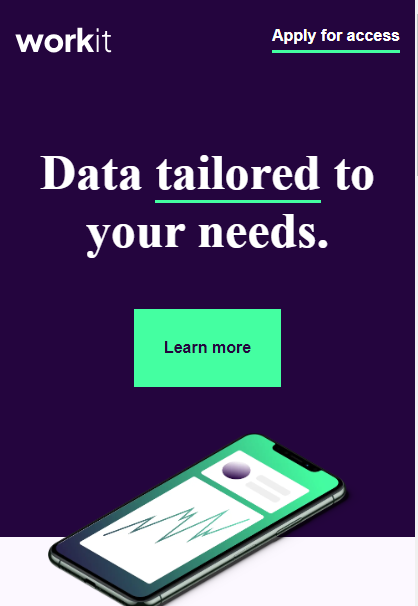

# Frontend Mentor - Workit landing page solution

This is a solution to the [Workit landing page challenge on Frontend Mentor](https://www.frontendmentor.io/challenges/workit-landing-page-2fYnyle5lu). Frontend Mentor challenges help you improve your coding skills by building realistic projects. 

## Table of contents

- [Overview](#overview)
  - [The challenge](#the-challenge)
  - [Screenshot](#screenshot)
  - [Links](#links)
- [My process](#my-process)
  - [Built with](#built-with)
  - [What I learned](#what-i-learned)
  - [Continued development](#continued-development)
  - [Useful resources](#useful-resources)
- [Author](#author)
- [Acknowledgments](#acknowledgments)

## Overview

### The challenge

Users should be able to:

- View the optimal layout for the interface depending on their device's screen size
- See hover and focus states for all interactive elements on the page

### Screenshot

### Links

- Solution URL: [Add solution URL here](https://github.com/Mekuseo/Workit-Landing-Page)
- Live Site URL: [Add live site URL here](https://mekuseo.github.io/Workit-Landing-Page/)

## My process

### Built with

- Semantic HTML5 markup
- css
- Flexbox
- Mobile-first workflow
*

## Author

- Website - [My-portfolio](https://my-portfolio-86ro.onrender.com/)
- Frontend Mentor - [@Mekuseo](https://www.frontendmentor.io/profile/Mekuseo)
- Twitter - [@Fullstack_pison](https://www.twitter.com/Fullstack_pison)

## Acknowledgments

This is where you can give a hat tip to anyone who helped you out on this project. Perhaps you worked in a team or got some inspiration from someone else's solution. This is the perfect place to give them some credit.

**Note: Delete this note and edit this section's content as necessary. If you completed this challenge by yourself, feel free to delete this section entirely.**
